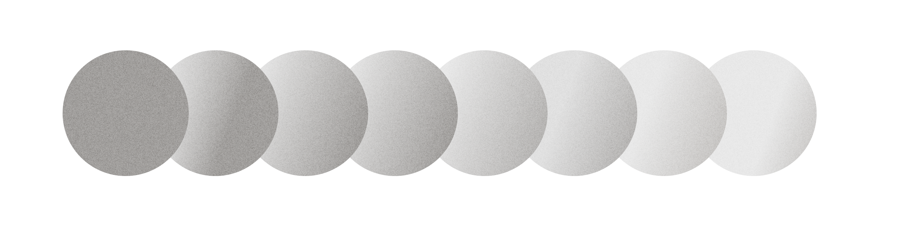

import Values from '../components/intro/Values';
import FalseCard from '../components/intro/FalseCard';
import CTA from '../components/intro/CTA';

# Introduction

## Here's what we believe:

<Values />

## To be clear, we are not:

    <FalseCard title='We do NOT advocate for slowing or pausing AI capabilities research.'>
        The best alignment methods have stemmed from advancements in AI capabilities—a trend we expect to continue. Moreover, pausing AI at this stage is completely unrealistic and undesirable due to overwhelming economic and
        technological incentives.
    </FalseCard>

    <FalseCard title='We are NOT suggesting that a misaligned AGI must possess consciousness (or to even understand their own actions like we do).'>
        An AGI doesn't need animosity towards humans to be dangerous. Just as autonomous drones can be dangerous without consciousness, a misaligned AGI, with its significantly greater potential, could be far more
        hazardous.

        Here's another example to demonstrate that even AI today can cause real damage: if AI agents were able to successfully optimize for both making and spending money, they would be able to take actions with real impact. This is incredibly plausible: agents like Cognition Labs's [Devin](https://www.cognition.ai/blog/introducing-devin) are *already* able make money by completing freelance jobs. 
    </FalseCard>

## What's this all about?

Misaligned AI ≠ Terminator movies. Superintelligence doesn't need to be 'evil' to pose a threat. By default, all intelligent agents—including
humans—aim to preserve themselves, acquire resources, and improve themselves. <b>This means AI smarter than us could inadvertently endanger humanity.</b>

Think of when the atomic bomb was first being created: before we ever needed to worry about misuse, there was the very real possibility that we could accidentally set the world on fire.

We’re on the path to build something much harder to contain than nuclear weapons: superintelligent AI. Alignment is making sure we don’t <b>accidentally</b> end the world.

<CTA />